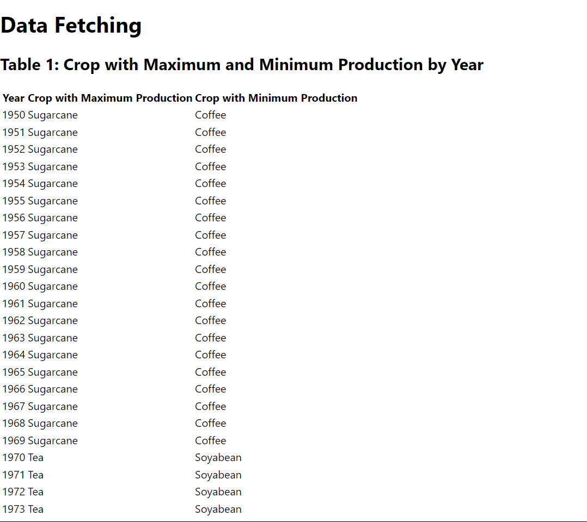
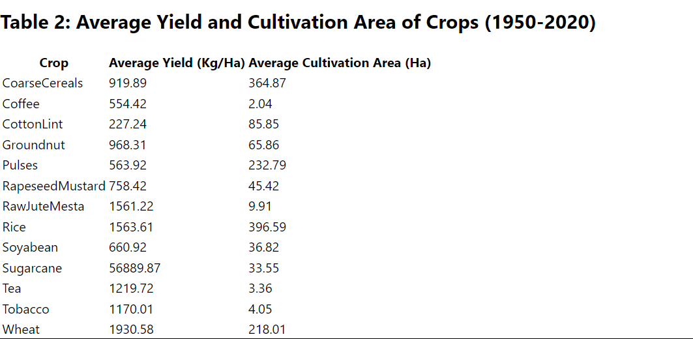

# Getting Started with Create React App

Clone the Project using 
### `git clone https://github.com/17prateek12/manufac_sde_task.git` 

To install dependancy
### `yarn install`

Then you can run:

### `yarn start`

# Table 1

# Table

